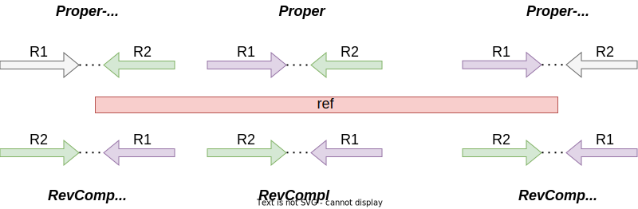

# Paired-end reads flags in SAM files

## The dataset

The `reads` directory contains a single dataset of *paired end reads*:
`reads_R1.fq` and `reads_R2.fq` contains the forward and reverse reads, respectively.

The dataset is composed by the following *read pairs*:

Both reads mapped against the reference in a proper pair:
* proper.1: forward fragment on the + strand, reverse fragment on the - strand
* revcompl.1: forward fragment on the - strand, reverse fragment on the + strand

One reads not aligned:
* proper-1na.1: first reads is not mapped (second is on the - strand)
* proper-2na.1: second read is not mapped (first is on the + strand)
* revcompl-1na.1: first reads is not mapped (second is on the + strand)
* revcompl-2na.1: second read is not mapped (first is on the - strand)

Both reads are not mapped:

* unmap.1

## Reads diagram

Schematic representation (coordinates not to scale, overlapping reads are spread apart
to simplify the picture) of the read pairs

## The SAM output

Here we report the truncated SAM output

Read name    |  Flag |  Ref name      | Position | Qual | CIGAR | Mate ref | Mate Pos. | Size
-------------|-------|----------------|----------|------|-------|----------|-----------|------
proper.1     |   97  |    ctg1  |    51    |  60  |    50M |    =    |   151    | 150
proper.1     |   145 |    ctg1  |    151   |  60  |    50M |    =    |   51     | -150
revcompl.1   |   81  |    ctg1  |    51    |  60  |    50M |    =    |   151    | 52
revcompl.1   |   161 |    ctg1  |    151   |  60  |    50M |    =    |   51     | -52
proper-1na.1 |   117 |    ctg1  |    151   |  0   |    *   |    =    |   151    | 0
proper-1na.1 |   185 |    ctg1  |    151   |  60  |    50M |    =    |   151    | 0
proper-2na.1 |   73  |    ctg1  |    51    |  60  |    50M |    =    |   51     | 0
proper-2na.1 |   133 |    ctg1  |    51    |  0   |    *   |    =    |   51     | 0
revcompl-1na.1 | 69  |    ctg1  |    151   |  0   |    *   |    =    |   151    | 0
revcompl-1na.1 | 137 |    ctg1  |    151   |  60  |    50M |    =    |   151    | 0
revcompl-2na.1 | 121 |    ctg1  |    51    |  60  |    50M |    =    |   51     | 0
revcompl-2na.1 | 181 |    ctg1  |    51    |  0   |    *   |    =    |   51     | 0
unmap.1        | 77     |   *   |      0   |   0  |    *     |  *   |    0   |    0
unmap.1        | 141    |   *   |      0   |   0  |    *     |  *   |    0   |    0
 
